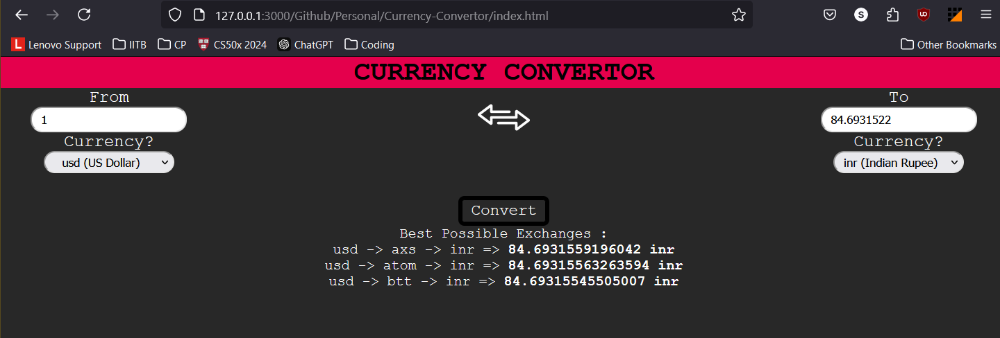

# Currency Convertor with best possible way (1 intermediate)
## API I used
`https://github.com/fawazahmed0/exchange-api`
Reason was that it was always free with unlimited API requests. I depleted the limit of one of the options in the docs just while developing the website :P.
Also if I go with bonus assignment, the api request limit will be depleted in no time so this one is slightly better in that case.

There is one issue that there are a lot of crypto currencies as well which gives a very bad experience.
## HTML and CSS
I know HTML and CSS as I was learning them after the first sem.
I searched almost everything about javascript online, browsed mdn docs and stackoverflow for all the help I need.

I do have some experience of Javascript but I was not so fluent. As of now, I have not added any comments in the code and I will be doing it now as the website is not functional.

That part of the project was fairly easy.
## JAVASCRIPT
I almost had to learn it from scratch, the only think I knew was DOMContentLoaded xD. Youtubers like love babbar really helped me

I learned following things while building project simultaneously -
- Asynch and Await
- Promises
- Changing html through JS
- Objects
- Arrays
and so on..

## Question I can't find answer to - 
After searching for the answer to this question in the vast stack of stackoverflow questions, in the sweaty alleys of reddit and then when lord chatgpt themself said to give up, I am here without the answer to this question.

VS Code Live Preview - 
 

Firefox(http://) - 

They both give different top 3 methods(firefox is right I guess).

Maybe it's just the api **(╬▔皿▔)╯**

This is the github repo if anyone want to visit - https://github.com/ShubhSarin/Currency-Convertor (The zip file is final for recruitment, I used github for myself).